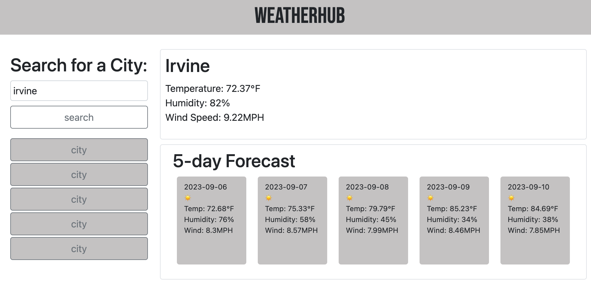

# Weather-App

## Description
My motivation for this was to create a weather app. The app will have a search bar for users to input their city of choice to view the forecast for the current day and the next five days as well. I leanred how to work with different webAPIs to pull the proper weather data needed per section.

## Installation

1. Clone from repo.
2. Open folder with visual studio code or any text editor of choice.
3. Run index.html to run code.

## Usage

This is the main page of the weather app. Users can look up the weather by city using the search field. Clicking on the search button will generate the current forecast, and the forecast for the next 5 days. 

## Deployed Website Link

https://lndvng.github.io/weather-app/